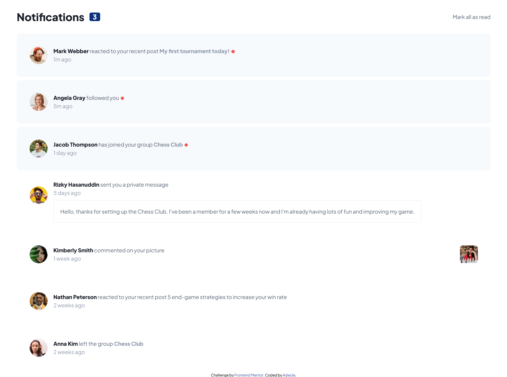

# Frontend Mentor - Notifications page solution

This is a solution to the [Notifications page challenge on Frontend Mentor](https://www.frontendmentor.io/challenges/notifications-page-DqK5QAmKbC). Frontend Mentor challenges help you improve your coding skills by building realistic projects. 

## Table of contents

- [Overview](#overview)
  - [The challenge](#the-challenge)
  - [Screenshot](#screenshot)
  - [Links](#links)
- [My process](#my-process)
  - [Built with](#built-with)
  - [What I learned](#what-i-learned)
  - [Useful resources](#useful-resources)
- [Author](#author)

**Note: Delete this note and update the table of contents based on what sections you keep.**

## Overview

### The challenge

Users should be able to:

- Distinguish between "unread" and "read" notifications
- Select "Mark all as read" to toggle the visual state of the unread notifications and set the number of unread messages to zero
- View the optimal layout for the interface depending on their device's screen size
- See hover and focus states for all interactive elements on the page

### Screenshot



### Links

- Live Site URL: [Add live site URL here](https://notificationsbyade.netlify.app)

## My process

### Built with

- Flexbox
- SASS
- vanilla JavaScipt
- HTML

### What I learned

My major learning is that min width and min height can be used to prevent elements from shrinking
& the span element cannot be used to create shapes, div is best for the job.

SOME CODE i AM PROUD OF
```js
  for (i = 0; i < 4; i++) {
    activeClass[i].classList.remove("active");
  }
```

### Useful resources

- [Example resource 1](https://www.w3schools.com/jsref/met_document_queryselectorall.asp) - Helped me understand how querySelectorAll() works
- [Example resource 2](https://stackoverflow.com/questions/61134127/how-to-prevent-the-html-elements-being-compressed-vertically-whenever-you-inspec) - Deepend my understanding on min width

## Author
- Frontend Mentor - [@Adeola](https://www.frontendmentor.io/profile/adex-hub)
- Twitter - [@ade_thedev](https://www.twitter.com/ade_thedev)
